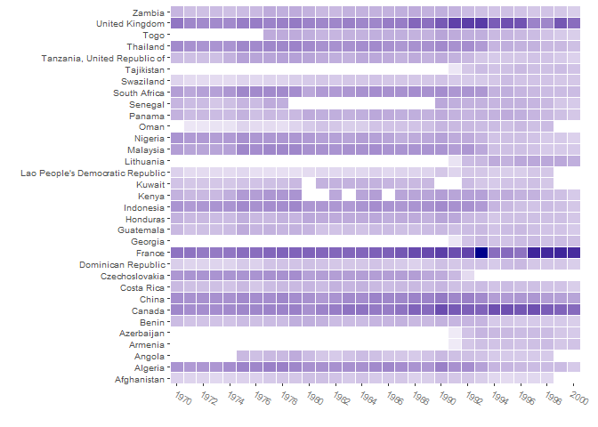
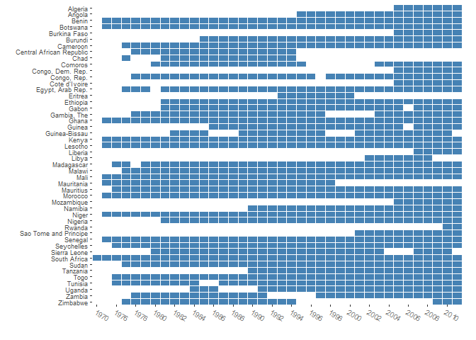
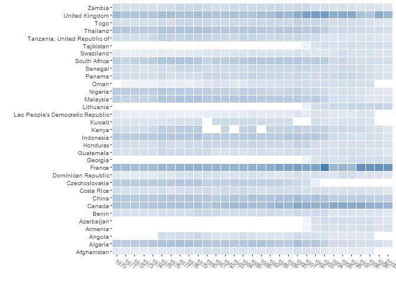
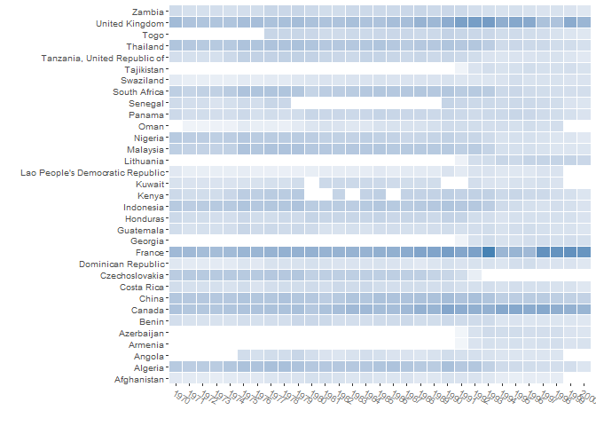
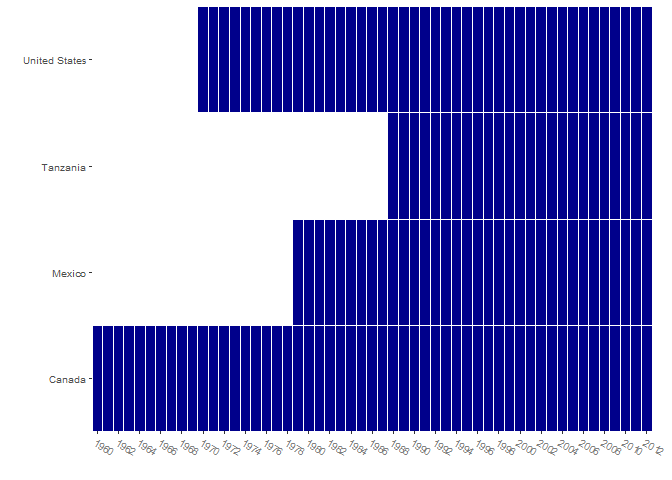
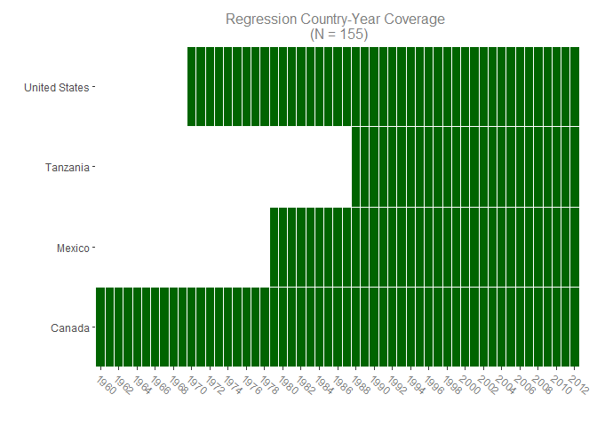

Coverage
================
Sondre U. Solstad

An R package for seeing what you're missing
===========================================

The coverage package and associated function provides you with a summary of your time and unit coverage. This is important for any analysis conducted with row-wise deletion in the presence of missing data, especially if one suspect that patterns of missingness are non-random with respect to variables of interest. Examples of such analysis include standard regression analysis and most implementations of maximum likelihood. By default, the function provides a data frame of unit and time coverage ("coverage.df") and a summary of time coverage by unit ("coverage.summary"). It can also additionally supply a latex table or a visualization of coverage. Finally, the function also supports 3-dimensional data by providing total number of observations in tables, and a "heatmap" of observations in visual.



-   An example of row-wise coverage in technology-country-year data

Arguments:
----------

-   **fit** A fitted object. Currently supports base R **lm()**.
-   **timevar** - Your time variable.
-   **unitvar** - Your unit variable.
-   **data** - Data to be investigated. If none is supplied, defaults to data used in "**fit**" if fit is in supported format.
-   **variable.names** - Variables to be checked for coverage. If none is supplied, defaults to variables used in **fit**.
-   **output** - Desired output: "visual" or "latex.table". Former depends on requires the package **ggplot2**, latter requires the package **stargazer**, both available on CRAN.

Example
-------

Let's illustrate the use of the package using an example. We begin by getting some data from the World Bank Development Indicators, using the WDI package (by Vincent Arel-Bundock). Let's get data on GDP per capita, trade in services as a percentage of GDP, adult female literacy rates, agriculture as a percentage of GDP, and finally, number of telephone subscriptions per 1000 people.

``` r
library("WDI", quietly = TRUE)
wdi.sample <- WDI(indicator=c('NY.GDP.PCAP.KD',
                              'BG.GSR.NFSV.GD.ZS',
                              'SE.ADT.LITR.FE.ZS',
                              'NV.AGR.TOTL.ZS',
                              'IT.TEL.TOTL.P3'),

                              country=c('MX','CA',
                              'US','TZ'),

                              start=1950, end=2012)

 colnames(wdi.sample)[4:8] <- c("GDPPC",
                                "services_gdp",
                                "literacy_women",
                                "agriculture_gdp",
                                "telephones")
```

Suppose we next are interested in how well "trade in services as a percentage of GDP" predicts "GDP per capita".

``` r
lm.fit <- lm(GDPPC ~ services_gdp, data = wdi.sample)
summary(lm.fit)
```

    ## 
    ## Call:
    ## lm(formula = GDPPC ~ services_gdp, data = wdi.sample)
    ## 
    ## Residuals:
    ##      Min       1Q   Median       3Q      Max 
    ## -23454.6 -16054.0   -688.3  12475.8  29269.1 
    ## 
    ## Coefficients:
    ##              Estimate Std. Error t value Pr(>|t|)    
    ## (Intercept)   33306.9     2595.1  12.834  < 2e-16 ***
    ## services_gdp  -1256.0      297.4  -4.224 4.11e-05 ***
    ## ---
    ## Signif. codes:  0 '***' 0.001 '**' 0.01 '*' 0.05 '.' 0.1 ' ' 1
    ## 
    ## Residual standard error: 15850 on 153 degrees of freedom
    ##   (57 observations deleted due to missingness)
    ## Multiple R-squared:  0.1044, Adjusted R-squared:  0.09857 
    ## F-statistic: 17.84 on 1 and 153 DF,  p-value: 4.112e-05

So we have some data and a statistically significant relationship. But which country-years is this relationship based on? One option would be to inspect the data manually, which is viable only if the number of units (countries) and time points (years) are both small. And even in such a case, it is still very tidious. Let's instead apply the coverage function:

``` r
library("coverage")
 coverage(fit = lm.fit, timevar = "year",
          unitvar = "country")

 coverage.summary
```

    ##            Unit Total Observations Total time coverage Covered time 
    ## 1        Canada                 53                  53     1960-2012
    ## 3        Mexico                 34                  34     1979-2012
    ## 4      Tanzania                 25                  25     1988-2012
    ## 2 United States                 43                  43     1970-2012

Let us also request a visual representation:

``` r
 library("ggplot2", verbose = FALSE)
 
 coverage(fit = lm.fit, timevar = "year",
         unitvar = "country", output = "visual")
```



Or a latex table:

``` r
 library("stargazer", quietly = TRUE)
 coverage(fit = lm.fit, timevar = "year",
          unitvar = "country", output = "latex.table")
```

    ## 
    ## % Table created by stargazer v.5.2 by Marek Hlavac, Harvard University. E-mail: hlavac at fas.harvard.edu
    ## % Date and time: Tue, Dec 06, 2016 - 4:09:25 PM
    ## \begin{table}[!htbp] \centering 
    ##   \caption{} 
    ##   \label{} 
    ## \tiny 
    ## \begin{tabular}{@{\extracolsep{5pt}} cccc} 
    ## \\[-1.8ex]\hline 
    ## \hline \\[-1.8ex] 
    ## Unit & Total Observations & Total time coverage & Covered time  \\ 
    ## \hline \\[-1.8ex] 
    ## Canada & $53$ & $53$ & 1960-2012 \\ 
    ## United States & $43$ & $43$ & 1970-2012 \\ 
    ## Mexico & $34$ & $34$ & 1979-2012 \\ 
    ## Tanzania & $25$ & $25$ & 1988-2012 \\ 
    ## \hline \\[-1.8ex] 
    ## \end{tabular} 
    ## \end{table}

Supplying a fit is not required, and it may be easier to compare the coverage consequences of different model specifications by instead providing the variable names. This is supported in **coverage()** through the variable.names and data arguments.

Let's use this functionality to visually explore our data:

``` r
 coverage(timevar = "year", unitvar = "country",
          data = wdi.sample,
          variable.names = c("GDPPC",
                             "agriculture_gdp"),
          output = "visual")
```



``` r
 # vs:
 coverage(timevar = "year", unitvar = "country",
          data = wdi.sample,
          variable.names = c("GDPPC",
          "services_gdp"),
          output = "visual")
```


3-Dimensional Data
------------------

Suppose next that we have data that may have multiple observations per time and unit combination. For instance, suppose that instead of looking at country-year data, we had country-year-technology data, where data might be missing for specific technologies within a country in a specific year or for covariates at the country-year level.

``` r
techdata <- readRDS("3d_example.RDS")

head(techdata)
```

    ##                             country_name year  tpop upop xlrealgdp      technology adoption_lvl
    ## 1526412                         Malaysia 1970 10390 1216     22684      pest_total           NA
    ## 1526413 Lao People's Democratic Republic 1970  2962  156      2127     vehicle_car        11000
    ## 1526417                  Solomon Islands 1970    NA   NA        NA steel_stainless           NA
    ## 1526418                         Thailand 1970 36370 2313     62842     steel_other           NA
    ## 1526419                         Thailand 1970 36370 2313     62842     vehicle_com          163
    ## 1526422                  Solomon Islands 1970    NA   NA        NA pcthomedialysis           NA

``` r
coverage(timevar = "year", unitvar = "country_name",
          data = techdata,
          variable.names = c("upop", "xlrealgdp", "adoption_lvl"),
          output = "visual")
```



``` r
coverage.summary
```

    ##                                Unit Total Observations Total time coverage                         Covered time 
    ## 1                       Afghanistan                408                  29                             1970-1998
    ## 2                           Algeria                919                  31                             1970-2000
    ## 27                           Angola                418                  24                             1975-1998
    ## 29                          Armenia                162                  10                             1991-2000
    ## 30                       Azerbaijan                172                  10                             1991-2000
    ## 3                             Benin                581                  31                             1970-2000
    ## 4                            Canada               1282                  31                             1970-2000
    ## 5                             China               1009                  31                             1970-2000
    ## 6                        Costa Rica                585                  31                             1970-2000
    ## 7                    Czechoslovakia                643                  23                             1970-1992
    ## 8                Dominican Republic                484                  31                             1970-2000
    ## 9                            France               1533                  31                             1970-2000
    ## 31                          Georgia                171                  10                             1991-2000
    ## 10                        Guatemala                585                  31                             1970-2000
    ## 11                         Honduras                657                  31                             1970-2000
    ## 12                        Indonesia                882                  31                             1970-2000
    ## 13                            Kenya                660                  27 1970-1979, 1982, 1984-1985, 1987-2000
    ## 14                           Kuwait                480                  26       1970-1979, 1981-1989, 1992-1998
    ## 15 Lao People's Democratic Republic                348                  29                             1970-1998
    ## 32                        Lithuania                216                  10                             1991-2000
    ## 16                         Malaysia                852                  31                             1970-2000
    ## 17                          Nigeria                769                  31                             1970-2000
    ## 26                             Oman                419                  28                             1971-1998
    ## 18                           Panama                663                  31                             1970-2000
    ## 19                          Senegal                409                  20                  1970-1978, 1990-2000
    ## 20                     South Africa                881                  31                             1970-2000
    ## 21                        Swaziland                452                  31                             1970-2000
    ## 33                       Tajikistan                169                  10                             1991-2000
    ## 22     Tanzania, United Republic of                656                  31                             1970-2000
    ## 23                         Thailand                931                  31                             1970-2000
    ## 28                             Togo                516                  24                             1977-2000
    ## 24                   United Kingdom               1279                  31                             1970-2000
    ## 25                           Zambia                620                  31                             1970-2000

Customization
-------------

Let us return to our WDI data:

``` r
coverage(fit = lm.fit, timevar = "year",
         unitvar = "country", output = "visual")
```



We may have many reasons to customize this graphic. One way to do so is to ask coverage to give us the underlying code for the plot:

``` r
 coverage(fit = lm.fit, timevar = "year",
         unitvar = "country", visual.source = TRUE)
```

    ## [1] "library(ggplot2)"
    ## [1] "base_size <- 9"
    ## [1] "p <- ggplot(coverage, aes(Time, Unit)) + geom_tile(aes(fill = N), colour = 'white') + scale_fill_gradient(low = 'white', high = 'darkblue') + theme_grey(base_size = base_size) + labs(x = '', y = '') + scale_x_discrete(expand = c(0, 0), breaks=pretty(as.numeric(as.character(coverage$Time)), n=20)) + scale_y_discrete(expand = c(0, 0)) + theme(legend.position = 'none', axis.text.x = element_text(size = base_size * 0.8, angle = 330, hjust = 0, colour = 'grey50'), plot.margin = unit(c(5, 15, 5, 5), 'pt'))"

We can then manipulate this if we are not happy with the default settings:

``` r
library(ggplot2)
base_size <- 11 # Larger text size

p <- ggplot(coverage.df, aes(Time, Unit))  
p <- p + geom_tile(aes(fill = N), colour = 'white') 
p <- p + scale_fill_gradient(low = 'white', high = 'darkgreen') # Green instead of blue 
p <- p + ggtitle(paste0("Regression Country-Year Coverage \n (N = ", sum(coverage.df$N), ")")) # Adding title
p <- p + theme_grey(base_size = base_size) # theme_bw instead of theme_grey 
p <- p + labs(x = '', y = '') # Removing axis labels 
p <- p + scale_x_discrete(expand = c(0, 0), breaks=pretty(as.numeric(as.character(coverage.df$Time)), n=25)) + scale_y_discrete(expand = c(0, 0)) # Changing number of x-axis tics
p <- p + theme(legend.position = 'none', axis.text.x = element_text(size = base_size * 0.8, angle = 320, hjust = 0, colour = 'grey50'), plot.margin = unit(c(10, 15, 10, 5), "pt"), plot.title = element_text(color="grey50", size=12)) # Removing legend, adjusting angle on x-axis tics, increasing top and bottom margin (order of terms is top, right, bottom, left), changing title color and size.
p
```


