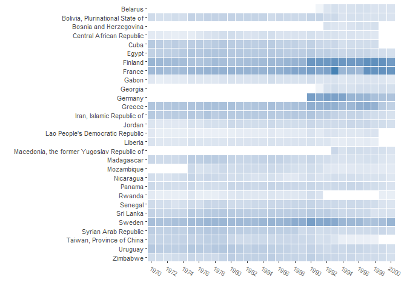
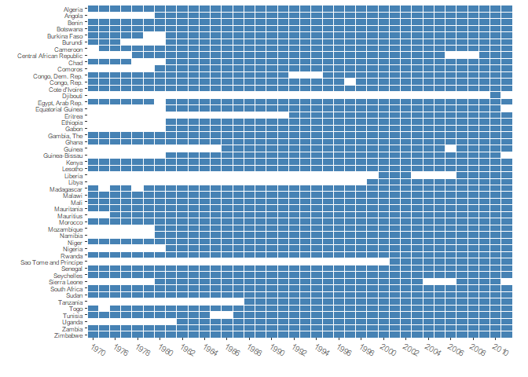
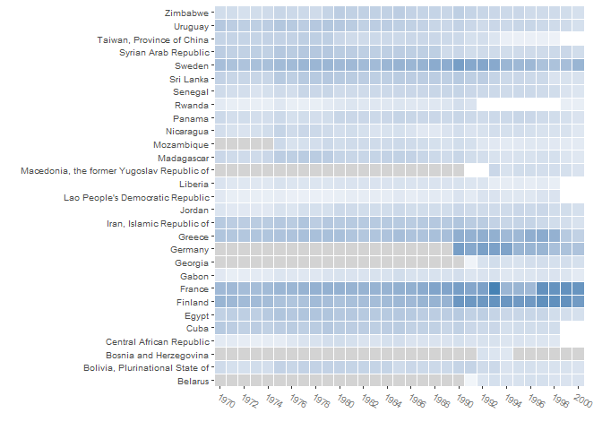

Coverage
================
Sondre U. Solstad

An R package for seeing what you're missing
===========================================

    ## Warning: package 'ggplot2' was built under R version 3.4.4

    ## Warning: package 'stargazer' was built under R version 3.4.4

    ## 
    ## Please cite as:

    ##  Hlavac, Marek (2018). stargazer: Well-Formatted Regression and Summary Statistics Tables.

    ##  R package version 5.2.2. https://CRAN.R-project.org/package=stargazer

The coverage package and associated function provides you with a visual, data frame or latex table summary of your time and unit coverage.

This is important for any analysis conducted with row-wise deletion in the presence of missing data, especially if one suspect that patterns of missingness are non-random with respect to variables of interest.

The function supports N-dimensional data by allowing for and summarizing multiple observations per time-unit combination.

Installation instructions:

``` r
library(devtools)
install_github("sondreus/coverage")
```



-   *An example of analysis coverage for technology-country-year data*

Arguments:
----------

-   **fit** A fitted object.
-   **timevar** Time variable. Defaults to "year".
-   **unitvar** Unit variable. Defaults to "country".
-   **data** Data to be investigated. If none is supplied, attempts to use same data as "", first by considering its model matrix, and - if variables are missing (such as timevar and unitvar) - by looking for the source data in the global environment. (Optional)
-   **variable.names** Variables to be checked for coverage. If none is supplied, defaults to variables used in *fit*, or if fit not provided, all variables in data. (Optional)
-   **output** Desired extra output: "visual" (default), "data.frame", or "latex.table". First depends on *ggplot2*, last *stargazer*, both available on CRAN.
-   **special.NA** Variable that if missing will indicate "special" missingness. Can be used to distinguish observations with missing data from time-unit combinations which did not exist or were not considered. (Optional)
-   **data.frequency** Integer specifying the increments between observations. Defaults to 1.
-   **...** Additional arguments passed to ggplot2's theme function, or stargazer, depending on output selected. (Optional) \#\# Example

Let's see how this package works through a simple application. We begin by getting some data from the World Bank Development Indicators, using the WDI package (by Vincent Arel-Bundock). Let's get data on GDP per capita, trade in services as a percentage of GDP, adult female literacy rates, agriculture as a percentage of GDP, and finally, number of telephone subscriptions per 1000 people.

``` r
library("WDI", quietly = TRUE)
```

    ## Warning: package 'WDI' was built under R version 3.4.4

``` r
wdi.sample <- WDI(indicator=c("GDPPC" = "NY.GDP.PCAP.KD",
                              "services_gdp" = "BG.GSR.NFSV.GD.ZS",
                              "agriculture_gdp" = "NV.AGR.TOTL.ZS",
                              "telephones" = "IT.TEL.TOTL.P3"),
                              start=1970, end=2012,
                              country="all")

lm.fit <- lm(GDPPC ~ ., data = wdi.sample)
```

Suppose we next are interested in how well "trade in services as a percentage of GDP" predicts "GDP per capita".

``` r
lm.fit <- lm(GDPPC ~ services_gdp + agriculture_gdp + telephones, data = wdi.sample)
```

So we have some data and a statistically significant relationship. But which country-years is this relationship based on? One option would be to inspect the data manually, which is viable only if the number of units (countries) and time points (years) are both small. And even in such a case, it is still very tidious. Let's instead apply the coverage function:

``` r
library("coverage")
 coverage(lm.fit)
```


Let us also request a data frame summary:

``` r
 coverage(fit = lm.fit, output = "data.frame")[1:10, ]
```

    ##                        Unit                 Time Total_N
    ## 42                  Algeria            2005-2011       7
    ## 39                   Angola            1995-2011      17
    ## 2                     Benin            1975-2011      37
    ## 3                  Botswana            1975-2011      37
    ## 43             Burkina Faso            2005-2011       7
    ## 34                  Burundi            1985-2011      27
    ## 17                 Cameroon            1977-2011      35
    ## 23 Central African Republic            1978-1994      17
    ## 18                     Chad      1977, 1981-1994      15
    ## 27                  Comoros 1980-1995, 2003-2011      25

Or a latex table:

``` r
l.tab <- coverage(fit = lm.fit, output = "latex.table")
```

    ## 
    ## % Table created by stargazer v.5.2.2 by Marek Hlavac, Harvard University. E-mail: hlavac at fas.harvard.edu
    ## % Date and time: Wed, Apr 17, 2019 - 9:24:14 PM
    ## \begin{table}[!htbp] \centering 
    ##   \caption{} 
    ##   \label{} 
    ## \tiny 
    ## \begin{tabular}{@{\extracolsep{5pt}} ccc} 
    ## \\[-1.8ex]\hline 
    ## \hline \\[-1.8ex] 
    ## Unit & Covered time & Total Observations \\ 
    ## \hline \\[-1.8ex] 
    ## Algeria & 2005-2011 & $7$ \\ 
    ## Angola & 1995-2011 & $17$ \\ 
    ## Benin & 1975-2011 & $37$ \\ 
    ## Botswana & 1975-2011 & $37$ \\ 
    ## Burkina Faso & 2005-2011 & $7$ \\ 
    ## Burundi & 1985-2011 & $27$ \\ 
    ## Cameroon & 1977-2011 & $35$ \\ 
    ## Central African Republic & 1978-1994 & $17$ \\ 
    ## Chad & 1977, 1981-1994 & $15$ \\ 
    ## Comoros & 1980-1995, 2003-2011 & $25$ \\ 
    ## Congo, Dem. Rep. & 2005-2011 & $7$ \\ 
    ## Congo, Rep. & 1978-1996, 1998-2011 & $33$ \\ 
    ## Cote d'Ivoire & 2005-2011 & $7$ \\ 
    ## Egypt, Arab Rep. & 1977-1979, 1981-2011 & $34$ \\ 
    ## Eritrea & 1993-2000 & $8$ \\ 
    ## Ethiopia & 1981-2011 & $31$ \\ 
    ## Gabon & 1981-2005, 2007-2011 & $30$ \\ 
    ## Gambia, The & 1978-1997, 2003-2011 & $29$ \\ 
    ## Ghana & 1975-2011 & $37$ \\ 
    ## Guinea & 1986-2005, 2007-2011 & $25$ \\ 
    ## Guinea-Bissau & 1982-1985, 1989-1997, 2001-2010 & $23$ \\ 
    ## Kenya & 1975-2011 & $37$ \\ 
    ## Lesotho & 1975-2011 & $37$ \\ 
    ## Liberia & 2007-2011 & $5$ \\ 
    ## Libya & 2002-2008 & $7$ \\ 
    ## Madagascar & 1976-1977, 1979-2011 & $35$ \\ 
    ## Malawi & 1977-2011 & $35$ \\ 
    ## Mali & 1975-2011 & $37$ \\ 
    ## Mauritania & 1975-1998 & $24$ \\ 
    ## Mauritius & 1976-2011 & $36$ \\ 
    ## Morocco & 1975-2011 & $37$ \\ 
    ## Mozambique & 2005-2011 & $7$ \\ 
    ## Namibia & 1990-2011 & $22$ \\ 
    ## Niger & 1975-2011 & $37$ \\ 
    ## Nigeria & 1981-2011 & $31$ \\ 
    ## Rwanda & 2010-2011 & $2$ \\ 
    ## Sao Tome and Principe & 2001-2011 & $11$ \\ 
    ## Senegal & 1975-2011 & $37$ \\ 
    ## Seychelles & 1976-2011 & $36$ \\ 
    ## Sierra Leone & 1980-2003, 2007-2010 & $28$ \\ 
    ## South Africa & 1970, 1975-2011 & $38$ \\ 
    ## Sudan & 1977-2011 & $35$ \\ 
    ## Tanzania & 1990-2011 & $22$ \\ 
    ## Togo & 1976-2011 & $36$ \\ 
    ## Tunisia & 1976-1984, 1987-2011 & $34$ \\ 
    ## Uganda & 1984-1986, 1991-2011 & $24$ \\ 
    ## Zambia & 1978-1991, 1997-2011 & $29$ \\ 
    ## Zimbabwe & 1977-1994, 2009-2011 & $21$ \\ 
    ## \hline \\[-1.8ex] 
    ## \end{tabular} 
    ## \end{table}

Supplying a fit is not required, and it may be easier to compare the coverage consequences of different model specifications by instead providing the variable names. This is supported in **coverage()** through the variable.names and data arguments.

Let's use this functionality to visually explore our data:

``` r
 coverage(data = wdi.sample,
          variable.names = c("GDPPC",
                             "agriculture_gdp", 
                             "telephones"),
          output = "visual")
```


``` r
 # vs:
 coverage(data = wdi.sample,
          variable.names = c("GDPPC",
          "telephones"),
          output = "visual")
```



3-Dimensional Data
------------------

Suppose next that we have data that may have multiple observations per time and unit combination. For instance, suppose that instead of looking at country-year data, we had country-year-technology data, where data might be missing for specific technologies within a country in a specific year or for covariates at the country-year level.

``` r
techdata <- readRDS("3d_example.RDS")

coverage(timevar = "year", unitvar = "country_name",
          data = techdata,
          variable.names = c("upop", "xlrealgdp", "adoption_lvl"))
```


Special missingness
-------------------

Not all missingness is equal. Sometimes, data on a given time-unit combination is not available because the combination did not exist. For instance, research subjects in a medical trial may join a study at different times. We often want to distinguish this type of missingness ("subject had not yet joined the trail") from other types of missingness ("subject failed to measure blood-pressure during trail").

**coverage()** provides a way to do so in its visual output through the "special.NA" argument. Coverage interprets missingness of the variable specified in "special.NA" to indicate that the time-unit combination does not exist, indicating this in the visual output by cells being light-grey.

Looking at our technology data, we can see that many apparently missing data points in fact are "special missing", belonging to countries that did not exist in the year in question. Suppose that we know our "government" variable has no missing data for independent countries but is missing for all other country-years. Then, we can use this as our "special.NA" variable.

``` r
coverage(timevar = "year", unitvar = "country_name",
          data = techdata,
          variable.names = c("upop", "xlrealgdp", "adoption_lvl"), output = "visual", special.NA = "government")
```



Note: If your data has time and unit values corresponding to *every and only* relevant time and unit combination, you can simply specify one of these as your "special.NA" variable. E.g. special.NA = "year".

Citation:
---------

Solstad, Sondre Ulvund (2018). *Coverage: Visualize Panel Data Coverage*. <https://github.com/sondreus/coverage#coverage>
